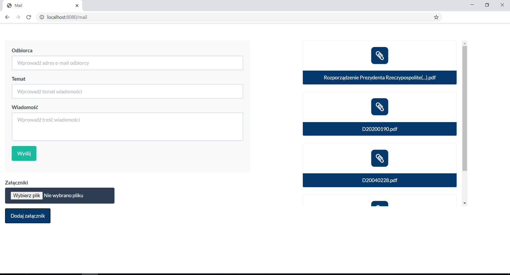

# MailSender
Java Spring application to send e-mail messages with attachments 
see application videos: https://drive.google.com/drive/folders/1H4dxEfE76TmvvnbFsH6kNwwMlZymm4aU?usp=sharing

<h2>Application description</h2>
Application to send e-mail messages with attachments has been created as result of getting to know Spring framework.
<ol>
	<li>User fills "to" address.<li>
	<ol>
	 	<li>If user does not fill "to" address - message appears (field can not be blank).</li>
		<li>If user does not fill valid "to" address - message appears (field has to be filled with valid address).</li>
	</ol>
	<li>User fills subject.</li>
	<ol>
		<li>If user does not fill subject  - message appears (field can not be blank).</li>
	</ol>
	<li>User fills message.</li>
	<ol>
		<li>User does not fill message - message appears (field can not be blank).</li>
	</ol>
	<li>User attaches an attachment.</li>
	<ol>
		<li>Attachment exceeded 10 MB - attachment was not added and message appears (attachment size too large) .</li>
		<li>Attachments title exceeded 50 characters - attachment was added however its title was limited up to 50 characters in view.</li>
		<li>User did not choose any file but pressed: "Add attachment" button - attachment was not added and message appears (please select a file).</li>
	</ol>
	<li>user sends message.</li>
</ol>
The "attachments" folder was used to store attachments - when user sends an e-mail the files are deleted.
<h3>Technology</h3>
<ul>
  <li>Spring</li>
  <ul>
	<li>spring-boot-starter-thymeleaf</li>
	<li>spring-boot-starter-mail</li>
	<li>spring-boot-starter</li>
	<li>spring-boot-starter-web</li>
  </ul>
  <li>commons-fileupload</li>
  <li>hibernate-validator</li>
  <li>Ajax</li>
  <li>JavaScript</li>
  <li>Bootstrap</li>
 </ul>

 

# MailSender
Aplikacja w Javie Spring służąca do wysyłania maili 
zobacz filmiki: https://drive.google.com/drive/folders/1H4dxEfE76TmvvnbFsH6kNwwMlZymm4aU?usp=sharing

<h2>Opis aplikacji</h2>
Aplikacja służąca do wysyłania maili wraz z załącznikami. Powstała w wyniku zapoznawania się z frameworkiem Spring.
<ol>
	<li>Użytkownik wpisuje adres odbiorcy.<li>
	<ol>
	 	<li>Użytkownik nie wpisał adresu odbiorcy - pojawia się komunikat, że pole nie może być puste.</li>
		<li>Użytkownik wpisał niepoprawny adres e-mail - pojawia się komunikat, że musi podać poprawnie sformatowany adres e-mail.</li>
	</ol>
	<li>Użytkownik wpisuje temat wiadomości.</li>
	<ol>
		<li>Użytkownik nie wpisał tematu wiadomości - pojawia się komunikat, że pole nie może być puste.</li>
	</ol>
	<li>Użytkownik wpisuje treść wiadomości.</li>
	<ol>
		<li>Użytkownik nie wpisał treści wiadomości- pojawia się komunikat, że pole nie może być puste.</li>
	</ol>
	<li>Użytkownik dołącza załącznik.</li>
	<ol>
		<li>Załącznik przekroczył 10 MB - załącznik nie został dodany i pojawia się komunikat, że załącznik zbyt duży.</li>
		<li>Tytuł załacznika przekroczył 50 znaków - załącznik został dodany jednak w widoku tytuł został ograniczony do 50 znaków.</li>
		<li>Użytkownik nie wybrał pliku jednak kliknął przycisk: "Dodaj załącznik" - załącznik nie zostaje dodany i pojawia się komunikat proszę wybrać plik.</li>
	</ol>
	<li>Użytkownik wysyła wiadomość.</li>
</ol>
Do przechowywania załączników wykorzystano folder attachments - po wysłaniu przez użytkownika maila pliki zostają z niego usunięte.

<h3>Technologia</h3>
<ul>
  <li>Spring</li>
  <ul>
	<li>spring-boot-starter-thymeleaf</li>
	<li>spring-boot-starter-mail</li>
	<li>spring-boot-starter</li>
	<li>spring-boot-starter-web</li>
  </ul>
  <li>commons-fileupload</li>
  <li>hibernate-validator</li>
  <li>Ajax</li>
  <li>JavaScript</li>
  <li>Bootstrap</li>
 </ul>

 
